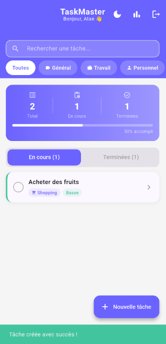
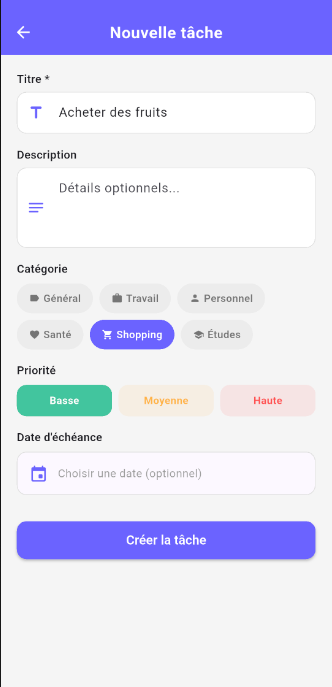
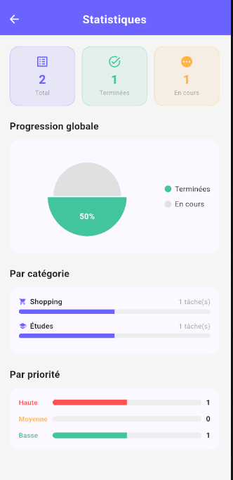
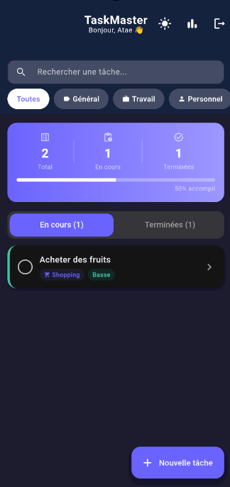

# TaskMaster 📋
> *Ta mission commence maintenant.*

Application mobile de gestion des tâches, développée avec Flutter dans le cadre d'un mini-projet académique (2ème année cycle ingénieur, 2025/2026).

---

## Fonctionnalités

- Authentification (inscription / connexion)
- Création, modification et suppression de tâches
- Catégories et niveaux de priorité
- Suivi de progression avec statistiques visuelles
- Stockage local avec SQLite
- Thème sombre / clair
- Interface responsive et moderne

---

## Captures d'écran

| Connexion | Inscription | Accueil |
|---|---|---|
|  |  |  |

| Nouvelle tâche | Statistiques | Mode sombre |
|---|---|---|
|  |  |  |

---

## Architecture MVC

```
lib/
├── models/          # Données : Task, User
├── views/           # Interfaces : auth, home, tâches, stats
│   └── home/widgets/
├── controllers/     # Logique : AuthController, TaskController, ThemeController
└── utils/           # Thème, base de données
```

---

## Technologies utilisées

| Outil | Usage |
|---|---|
| Flutter / Dart | Framework principal |
| SQLite (sqflite) | Stockage local |
| shared_preferences | Persistance de session |
| fl_chart | Graphiques statistiques |
| flutter_slidable | Interactions sur les cartes |
| intl | Formatage des dates |

---

## Installation

```bash
git clone <url-du-repo>
cd taskmaster
flutter pub get
flutter run
```

> Nécessite Flutter SDK ≥ 3.x et un émulateur ou appareil connecté.